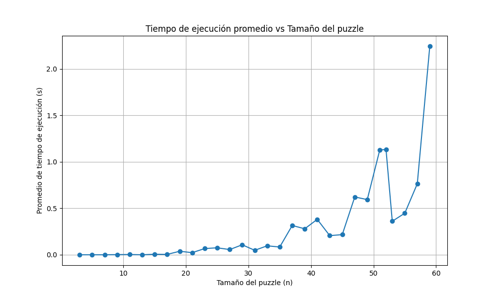
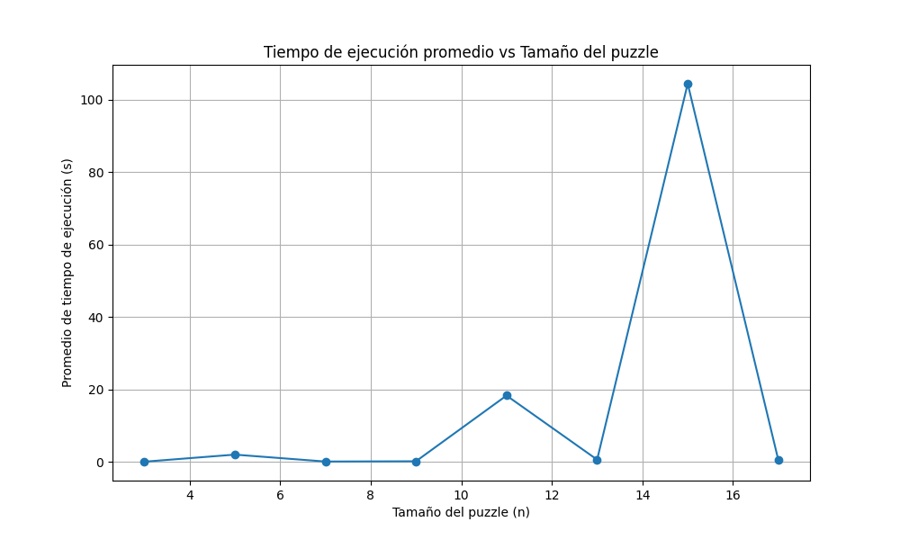
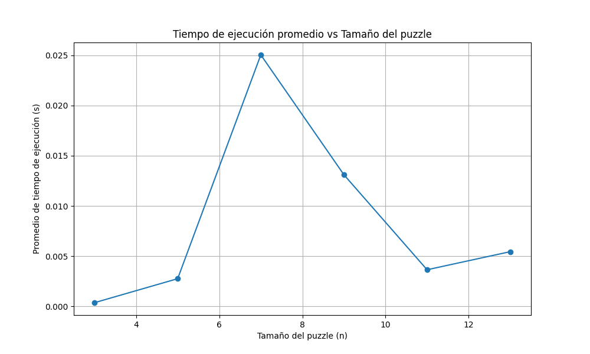
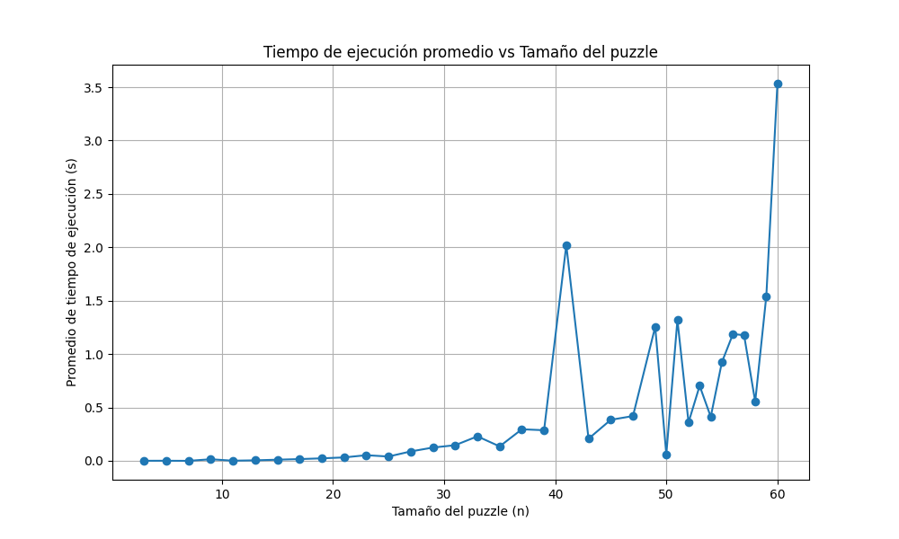
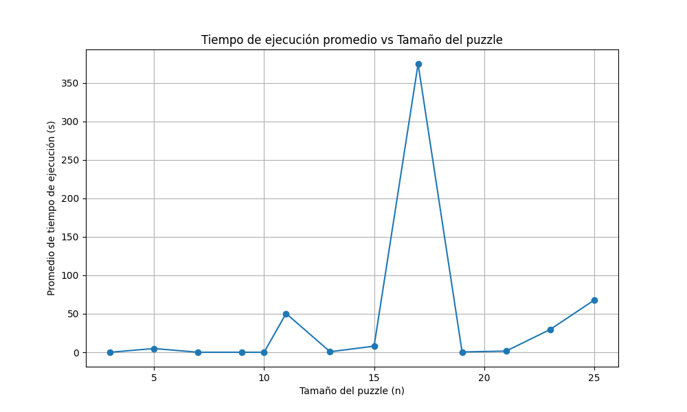

# **Reporte sobre BFS, DFS, Greedy & A\***

> Hecho por: Fabián Neftaly Guía Cruz, Daniela Gutierrez Pérez

## **¿Cómo funciona c/u en la implementación (incluyendo todas las funciones y clases utilizadas)?**

Los algoritmos se encuentran en el modulo Search_Algorithms, mientras que la evaluacion de si el estado inicial es valido se hace en Solvers (Main en la version de Parias), utilizando la clase State para el manejo de estados del juego.

- Búsqueda en Anchura (BFS):
  BFS utiliza una cola para explorar cada nivel de un árbol antes de pasar al siguiente, asegurando que la primera solución encontrada es la más cercana al punto de partida. El algoritmo inicia en el nodo raíz y, si cumple con la condición de objetivo, detiene la búsqueda y retorna el camino hacia la solución. De lo contrario, expande el nodo generando "hijos" (movimientos posibles en el puzzle) y coloca cada hijo en la cola, explorándolos en el orden en que se generaron. Además, evita repetir estados ya visitados.

- Búsqueda en Profundidad (DFS):
  DFS explora completamente un camino del árbol antes de retroceder para explorar otras rutas. Funciona con una pila, lo que permite una búsqueda profunda. Se establece un límite de 30 niveles para evitar caminos excesivamente largos o ciclos infinitos. Al alcanzar este límite sin encontrar una solución, el algoritmo abandona esa rama. Cada nodo explorado se registra en una lista, y sus hijos se agregan a la pila solo si no han sido visitados antes.

- Búsqueda Greedy:
  Este algoritmo elige los nodos que minimizan la distancia heurística hacia el objetivo, empleando la distancia de Manhattan como una medida de la cercanía al objetivo. Evalúa cada nodo en función de su valor heurístico, priorizando la expansión del nodo con menor distancia estimada. Una vez encontrado el objetivo, proporciona el camino de solución y cuenta los nodos explorados.

- Búsqueda A*:
  A* utiliza una combinación de la heurística de la distancia de Manhattan y el costo acumulado hasta el nodo actual. De este modo, se priorizan los nodos con el menor costo total estimado (heurística + costo) en la cola de prioridad, lo que permite una búsqueda eficiente que garantiza encontrar la solución óptima.

## **Para determinar si un juego se puede o no resolver, dice en la implementación que el número de inversiones debería ser par, ¿porqué? ¿cómo funciona de manera detallada este mecanismo?**

Esta regla se debe a que los movimientos en el rompecabezas solo intercambian dos piezas a la vez: la que se mueve y el espacio vacío. Este tipo de movimiento conserva la paridad del número de inversiones. En otras palabras, si el rompecabezas comienza con un número par de inversiones, es posible alcanzar el estado objetivo, donde todas las fichas están en orden y el número de inversiones es cero (un número par).

Por lo tanto, si el desorden inicial tiene un número par de inversiones, el rompecabezas es resoluble. Pero si el número de inversiones es impar, el desorden impide llegar al objetivo, sin importar cuántos movimientos se hagan.

En resumen, el rompecabezas solo es resoluble cuando el desorden tiene un número par de inversiones. Cuando el desorden es impar, los intercambios de a dos piezas no son suficientes para ordenar todas las fichas.

## **¿Cuál algoritmo se desempeña mejor para cualquier valor de n?**

En una respuesta rapida, A\* es el algoritmo con mejor desempeño para cualquier valor de n, en especial con la distancia Manhattan como heuristica. Debido a que la distancia Manhattan es una heurística admisible y consistente, lo que garantiza que A* siempre encuentra la solución óptima con la menor cantidad de nodos explorados. La gráfica A\*.1 muestra cómo el tiempo de ejecución promedio aumenta con el tamaño del puzzle (n), pero A* se mantiene eficiente incluso con tamaños mayores. Aunque el tiempo de ejecución aumenta notablemente para valores más altos de n, A\* sigue siendo manejable en comparación con otros algoritmos de búsqueda, gracias a su capacidad para reducir el espacio de búsqueda usando una heurística como la distancia Manhattan.

Que en este caso es mas eficiente que la heuristica por fichas descolocadas ya que la distancia Manhattan nos dice que tan lejos esta una ficha de estar colocada correctamente, en cambio las fichas descolocadas nos dice que tan alejados estamos de la solucion, lo que en ciertos casos puede ser contraproducente como se muestra en A\*.2.

A\*.1 (distancia manhattan)

---

A\*.2 (fichas descolocadas)

## **A\* Distancia Manhattan vs Fichas descolocadas**

La comparación entre las dos heurísticas, la distancia Manhattan y el conteo de fichas descolocadas, muestra cómo la primera es mucho más eficiente para guiar el algoritmo A\* hacia la solución. La distancia Manhattan calcula cuán lejos está cada ficha de su posición correcta, proporcionando una medida acumulativa del "costo" para cada ficha de alcanzar su destino final, lo que permite al algoritmo hacer estimaciones más precisas y tomar decisiones de búsqueda informadas.

En el gráfico del A*.1, donde se aplicó la distancia Manhattan, vemos que el tiempo de ejecución promedio se mantiene relativamente bajo, incluso para tableros grandes como 60x60, con un tiempo que apenas supera los 2 segundos. Esto indica que A* con distancia Manhattan puede manejar puzzles de mayor tamaño sin un incremento desmesurado en el tiempo de procesamiento.

En cambio, en el gráfico del A*.2, con la heurística de fichas descolocadas, el tiempo de ejecución es significativamente más alto. A partir de tableros de 15x15, el tiempo ya supera los 100 segundos. Esto se debe a que el conteo de fichas descolocadas ofrece menos información útil sobre la distancia real hacia el objetivo, lo que lleva al algoritmo a explorar un mayor número de estados innecesarios. Así, aunque ambas heurísticas son admisibles (aseguran encontrar la solución óptima), la distancia Manhattan optimiza mucho más el tiempo de ejecución en el algoritmo A*.

### **Otros graficos:**

- BFS
  
- Grady (Distancia Manhattan)
  
- Grady (Fichas descolocadas)
  

### **Explicacion de las graficas:**

Para cada algoritmo se realizó una serie de pruebas en puzzles generados aleatoriamente, con un mínimo de 𝑛 = 10 y un máximo de 𝑛 = 60, aplicando 15 movimientos aleatorios en cada puzzle. A continuación, se detallan los resultados obtenidos para cada algoritmo:

- BFS (Búsqueda en Anchura): Este algoritmo alcanzó un tiempo máximo de 0.025 segundos. Sin embargo, a partir de n=13, el tiempo de ejecución creció de forma exponencial, haciendo imposible esperar a que el algoritmo terminara su ejecución en tamaños de tablero más grandes.

- Greedy con distancia Manhattan: Se observó un crecimiento constante en el tiempo de ejecución conforme aumentaba el tamaño del puzzle. Este enfoque alcanzó un pico de 3.5 segundos, siendo el segundo mejor algoritmo en términos de eficiencia para resolver el n-puzzle.

- Greedy con fichas descolocadas: En este caso, el tiempo de ejecución se incrementó de manera extremadamente alta para los tableros más grandes, llegando a superar los 350 segundos. Debido a esto, se decidió limitar las pruebas a tableros de hasta 25x25.

- DFS (Búsqueda en Profundidad): No se incluyó una gráfica de este algoritmo, ya que incluso para tableros de tamaño
  𝑛
  n muy pequeño, el tiempo de ejecución puede extenderse demasiado. Aunque DFS encuentra soluciones, en muchos casos el tiempo requerido es extremadamente alto, especialmente en la versión no limitada, debido a la gran cantidad de nodos innecesarios explorados. En la versión limitada, también se presentan problemas, ya que el límite de profundidad puede impedir encontrar una solución en muchos casos. Lo mismo ocurre con la versión iterativa, que también experimenta tiempos de ejecución elevados.

Es importante notar que en cada incremento del tamaño del tablero, el problema propuesto es aleatorio, lo que introduce variabilidad en los tiempos de ejecución, resultando en picos de varianza notorios en los gráficos.

---

### **Codigo**

Todo el codigo fue hecho en base a la implementacion de [`Pariasrz`](https://github.com/Pariasrz/N-Puzzle-solver-with-Search-Algorithms), la implementacion para hacer este reporte lo puedes encontrar en un fork hecho por nosotros: [`Repositorio`](https://github.com/NeftaliGC/N-Puzzle-solver-with-BFS-DFS-Greedy-and-Astar/tree/main)
